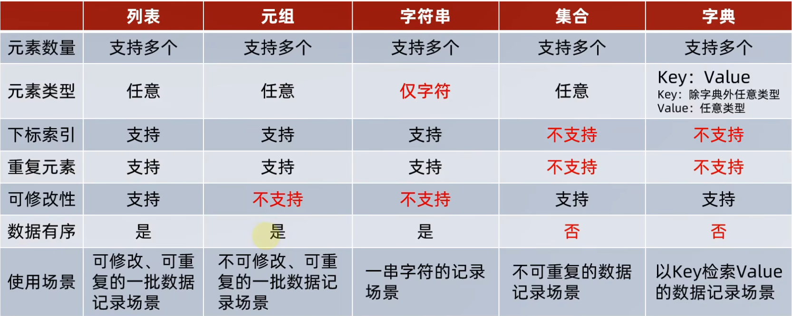

# 环境配置简述
官网下载：[python官网](https://www.python.org/downloads/windows/)，点击download，记得勾选PATH环境变量的配置。检查是否安装完成直接进入cmd窗口（win+r，键入cmd回车）键入py或者python，若成功安装则会弹出python的版本号等信息。  
接下来自行安装图形化界面pycharm。（当然也可用shell窗口执行，因为python是一门解释型的语言，即一行一行执行。）
# Python编程规范准则
在进入Python学习前，首先简略查看Python编程规范准则,打开Python解释器（或者打开网址：[Python之禅](https://peps.python.org/pep-0020/)）；输入import this,就能看到PEP（Python改进建议书）中的"The Zen of Python"（Python之禅）下面是经过翻译后的“蛇宗三字经”：
>Beautiful is better than ugly.

>美胜丑

>Explicit is better than implicit.

>明胜暗

>Simple is better than complex.

>简胜复

>Complex is better than complicated.

>复胜杂

>Flat is better than nested.

>浅胜深

>Sparse is better than dense.

>疏胜密

>Readability counts.

>辞达意

>Special cases aren’t special enough to break the rules.

>不逾矩

>Although practicality beats purity.

>弃至清（实用性优先）

>Errors should never pass silently.

>无阴差

>Unless explicitly silenced.

>有阳错

>In the face of ambiguity, refuse the temptation to guess.

>拒疑数

>There should be one– and preferably only one –obvious way to do it.

>求完一

>Although that way may not be obvious at first unless you’re Dutch.

>虽不至，向往之

>Now is better than never.

>敏于行

>Although never is often better than right now.

>戒莽撞

>If the implementation is hard to explain, it’s a bad idea.

>差难言

>If the implementation is easy to explain, it may be a good idea.

>好易说

>Namespaces are one honking great idea – let’s do more of those!

>每师出，多有名
# 前置
编译类语言（如C/C++,C#等）是是由源程序（以.py结尾的文本文件），经过编译器（compiler）为机器语言或者汇编语言（其中也会经过语法分析，预处理，性能优化），再经过链接器（linker）才能生成可执行程序（以.exe结尾）  
Python这类解释类语言不同，它采用解释器，按行读取一行代码就执行一行代码。另外，Python一般指的是CPython，即底层是C语言编写的，不做说明，Python就指CPython，除此之外还有Jython，PyPy等版本。
# 安装管理Python扩展包（库）
Python3.4后续的版本均自带pip和setuptools库，pip可用于安装管理Python扩展包，setuptools用于发布Python包。
使用时打开终端（cmd窗口）:
```py
下载扩展包：pip install 库
卸载扩展包：pip uninstall 库
查看已安装的扩展包：pip list
更新扩展包：pip install -u 库
查看过时（需要更新的扩展包）：pip list --outdated
```
# 集成开发环境
Python在下载时自带了一个集成开发环境IDLE，可以编写并执行程序。但一般使用Pycharm来进行集成开发。
# 程序的打包与发布
在编写完一个Python源文件后，以.py结尾。要变成可执行文件.exe，需要提前安装第三方扩展包PyInstaller,将.py变为.exe。  
PyInstaller将源文件生成可执行文件的方式如下：
```py
#在终端中：
installer -F source file.py
```
上述的-F指生成单个可执行文件，若需要所有支撑文件和子目录则可替换为-D。

# 字面量
类似于C/C++中的常量，python中的数据类型较C++中要多出数字类型的复数类型（complex），无双进度浮点型（double），只有浮点数（float），存在列表（list），元组（tuple），集合（set），字典（dictionary）(也即C++STL中的unordered_map，即无序键值对集合)  
另外，字面量在Python中是有它的地址的，用变量去接收字面量时实际上在底层是经过引用的。
# 注释
单行注释用#，多行注释为三个英文双引号包裹"""。  
```py
"""
这是一段注释，
这是第二段注释
"""
#这是一行注释
print("hello,世界！")
```
# 变量
变量定义与C++不同，由于python是一门动态语言，所以无需定义变量的数据类型，直接为`变量名=初值`    
字面量可以用id()函数来查看其唯一标识符，这个标识符表示字面量或者变量所引用的字面量的内存地址（虚拟内存）,而不是其真实的物理地址。
# 数据类型
python可以使用`type(变量)`来查看变量类型。返回值为一个类型对象，可通过print来打印显示。
```py
index=None
print(type(index))
```
# 类型转换
py可以使用`数据类型(变量/字面量)`来进行类型转换。但是py不支持隐式转换，即不能完成：
```py
a=123
b="111"
a+b#报错
```
**值得注意的是：py并不能进行类似于C++中将字符转换为对应的Ascll的强制类型转换，如：`(int)'A'`，这在py中是非法的**，要完成这样的操作，对应函数为：
```py
#将字符转换为Ascii码
ord('A')
#将Ascii码转换为字符
chr(65)
```
另外，浮点数转换为int会截断。
# 命名规范
在python中支持以中文来定义变量名，另外py建议使用下划线命名法。
# 运算符
与C++不同点为：`额外定义//为取整除，相当于C++将除法结果类型转换为int，/为普通除法，pow()函数简化为**`
```py
num=40
num//=20
print(num)
num**=10
print(num)
```
# 字符串相关
##  1. <a name=''></a>字符串定义
py支持单引号定义，双引号定义，三引号定义。
##  2. <a name='-1'></a>字符串拼接
用+号可以拼接字符。
##  3. <a name='-1'></a>字符串格式化
先看一个场景样例：要输出某人的电话号码。
```py
str_1="18283626869"
print("小明的电话号码是：%s" % str_1 )
```
这里%s表示(字符串类型)占位符，含义是对应表示有变量要来占位，*多变量的占位符，变量要用括号括起来，按照占位顺序填入*。
```py
str_1="18283626869"
str_2="hu"
print("小明的序号是：%s%s"%(str_1,str_2) )
```
占位符还有`%d(整型),%s(字符串),%f(浮点型)`
##  4. <a name='-1'></a>格式化精度控制
这一节和C的printf很类似，如下演示：
```py
print("第一个数字是：%7.2f"%3.1415926)
``` 
m.n其中m代表宽度限制，n表示精度控制。  


###  4.1. <a name='-1'></a>快速格式化
`f"内容{变量}"`
```py
print(f"圆周率的近似值为：{pi}")
```
**注意是在字符串前加上f**
# 输入
使用`input(提示信息)`函数完成。注意：input获取到的值永远是str类型。
若要将多个值输入，可以调用input的split方法。
# 判断语句
##  5. <a name='if'></a>if语句
格式为：
```py
if 条件表达式:
    判断体
```
***注意，这里py程序是靠缩进来判断判断体的范围的，与C++中使用{}来限定范围不同。***
##  6. <a name='if-else'></a>if-else语句
```py
if 条件表达式:
    成立的流程
else:
    不成立的流程
```
如：
```py
age=int(input("输入年龄："))#input接受的都是字符串
if age>=18:
    print("you are old enough")
else:
    print("you are so young")
```
##  7. <a name='if-elif-else'></a>if-elif-else语句
与C++中的if-else if-else语句相似。
##  8. <a name='-1'></a>实例
提示：通过导入random库，调用方法（C++中的接口函数）random.randint(左区间，右区间)，就能随机给出闭区间的整数。
```py
import random
guess_num=random.randint(1,10)
print(guess_num)
```
# 循环语句
##  9. <a name='while'></a>while语句
```py
while 条件:
    循环体
```
##  10. <a name='for'></a>for循环
要注意，这里的的for循环和C++中的for循环不同。
```py
for 临时变量 in 可迭代对象（字符串，元组，列表等）：
    循环体
```
如下：
```py
str_1='name'#字符串是可迭代对象
for x in str_1:
    print(x)
    #程序功能是将字符串内的单个字符取出打印并换行
```
###  10.1. <a name='range'></a>range语句
`range(num)`表示构建一个[0,num-1]的序列。  
`range(num1,num2)`表示构建从[num1,num2-1]的序列
`range(nums1,nums2,step)`第三个参数表示步长。  类似于C++的：
```cpp
for(int i=num1,i<num2,i+step){
    ...
}
```
借助range语句，就能实现类似与C++的for循环。
##  11. <a name='breakcontinue'></a>break语句和continue语句
和C++相似，不再赘述。
# 函数
```py
def 函数名(参数):
    函数体
    return 返回值
```
# 杂项
1. 在Python解释器中“_”是一个特殊变量，用以表示上次运算的结果。  
2. del语句可用来删除变量声明定义。
3. "is"可用来替换“==”
4. Python支持序列解包赋值：`a,b=1,3`，但要注意变量与序列元素个数相同。如果只需要解包部分值，那么可采用特殊变量“_”来占位：`_,c,d,_=1,2,3,4`
# 数据容器
##  12. <a name='list'></a>list列表
定义语法如下方式：
~~~py
字面量
[元素1,元素2...]
赋予给变量
变量=[元素1,元素2...]
定义空列表
变量=[]
变量=list()
~~~
值得说明的是，py中的list可以存放数据类型不同的元素。
```py
 访问列表某一个元素
列表[下标]
```
正向的访问（指从索引0开始向后）和C++相同，但py还支持反向访问，从最后一个元素开始，记作-1，依次往前递减。
```py
my_list = [1,2,3,4,5,6,7,8,9,10]
print(my_list[-1])#输出10
```
###  13. <a name='-1'></a>列表内置的方法
####  13.1. <a name='-1'></a>查询指定元素的下标
`列表.index()`  
返回元素的下标，若列表中无指定元素，则抛出错误ValueError。
####  13.2. <a name='-1'></a>修改指定下标的元素值
`列表[下标]=值`
####  13.3. <a name='-1'></a>按位置插入值
`列表.insert(下标，值)`
####  13.4. <a name='-1'></a>追加元素
`列表.append(值)`  
类似于C++中的`push_back()`。  
`列表.extend(其余数据容器)`也能完成将其余容器内的元素进行追加。
####  13.5. <a name='-1'></a>删除元素（按照索引删除）
方式1：`del 列表[下标]`  
方式2：`列表.pop(下标)`
####  13.6. <a name='-1'></a>删除元素（按值删除）
`列表.remove(值)`  
这个方法遍历列表，将对应的第一个值删除。
####  13.7. <a name='-1'></a>清空
`列表.clear()`
####  13.8. <a name='-1'></a>统计某元素的出现次数
`列表.count(值)`
####  13.9. <a name='-1'></a>统计列表的长度
`len(列表)`
##  14. <a name='tuple'></a>tuple元组
和C++的键值对元组不同。tuple可视作不可修改的list。   
定义和list列表的方式近似，只需要将方括号改为小括号即可。
由于元组的不可修改性，元组支持的常见方法只有index(),count(),len()。
##  15. <a name='str'></a>str字符串
支持下标访问（正向反向均可），字符串类型也不支持修改。但count(),index(),len()方法都是可以使用的。
字符串的独特方法为：  
###  15.1. <a name='-1'></a>字符串替换
`字符串.replace(字符串1，字符串2)`将字符串1替换为字符串2。
###  15.2. <a name='-1'></a>字符串分割
`字符串.split(按照哪一个字符进行分割)`返回值是一个列表对象。
```py
str_1 = 'hello world nice to meet you'
print(str_1.split(" "))#按照空格进行分割
```
结果为：`['hello', 'world', 'nice', 'to', 'meet', 'you']`
###  15.3. <a name='-1'></a>规整化处理/格式化处理
方法1：`字符串.strip()`将字符串中的空格和换行符去除
方法2：`字符串.strip(需要去除的字符)`将字符串中的指定字符去除
##  16. <a name='-1'></a>序列与切片操作
序列：内容连续，有序，支持下标索引的数据容器。例如：列表，元组，字符串都是序列。  
切片：从序列中去除子序列。  
语法：`序列[起始下标:结束下标:步长]`，起始下标和结束下标不写表示从头到尾。步长1表示不跳步取，负数为反向取。默认为1。
```py
nums=(0,1,2,3)
nums_1=nums[::2]#输出0 2
nums_2=nums[::-1]#输出3，2，1，0相当于反转元组
```
##  17. <a name='set'></a>集合set
无序（不维护插入顺序），去重的数据容器。  不支持下标索引，支持修改操作，是可迭代对象（支持for循环）。
使用大括号定义。
###  17.1. <a name='-1'></a>添加新元素（按值）
`集合.add(元素)` 
###  17.2. <a name='-1'></a>移除元素
`集合.remove(元素)` 
###  17.3. <a name='-1'></a>随机弹出元素
`集合.pop()`，随机返回一个元素并在集合中移除该元素。
###  17.4. <a name='-1'></a>清空
`集合.clear()`
###  17.5. <a name='-1'></a>取差集
返回一个新集合，而不修改集合1，2。   
`集合1.difference(集合2)`
###  17.6. <a name='-1'></a>消除差集
`集合1.difference_update(集合2)`和上一条不同的是，这个方法会修改集合1。
###  17.7. <a name='-1'></a>取并集
`集合1.union(集合2)`
###  17.8. <a name='-1'></a>统计元素个数
`len(集合)`
##  18. <a name='dict'></a>dict字典、映射
字典是可迭代的对象（支持循环遍历）  
字典定义和集合相似：  
```py
my_dict={key:value,key:value......}
```
py中的key不允许重复，如果重复，则后面的key会覆盖前面的键值对。不允许使用**索引**。类似于C++中的map。但注意，py中的字典不支持“典中典”的操作，即key不能为dict类型。除此之外，字典可以嵌套。  
通过键来访问值的方法为：`变量=字典名[键]`
###  18.1. <a name='-1'></a>新增（更新）元素
`字典[key]=value`，若key不存在，则新增，否则修改对应的值。
###  18.2. <a name='-1'></a>删除元素
`字典.pop(key)`，删除指定键值对。
###  18.3. <a name='-1'></a>统计元素（键值对）个数
`len(字典)`
###  18.4. <a name='-1'></a>清空字典
`字典.clear()`
###  18.5. <a name='key'></a>获取全部的key
`字典.keys（）`
##  19. <a name='-1'></a>总结

##  20. <a name='-1'></a>数据容器的通用操作
- 均支持循环遍历
- 均支持len()
- 均支持max()，min()
- 均支持数据容器的类型转换函数：list()（注意，字符串将会被拆分为单个字符储存进列表，字典将会被抛弃所有value，仅留下key）,tuple()（和上面相似）,str()（字典进行转换时会保留键值对，set()（所有元素去重，字典仅保留key，所有顺序失去）。**注意，数据容器实际上不支持将其余数据容器转换为dict，即不可以使用dict()函数进行转换**
- 支持指定容器排序:`sorted(容器,[reverse=True/False])`，默认升序排列。注意排序结果是作为list对象的。
# 函数进阶
##  21. <a name='-1'></a>多返回值
py支持函数可以多返回值，使用序列解包的方式接收：
```py
def return_many(num1,num2):
    return num1,num2
x,y=return_many(1,2)
```
##  22. <a name='-1'></a>传参调用方式
- 位置参数：
```py
def fun(num1,num2):
    do something
fun(1,2)
```
- 关键字传参
```py
def fun(num1,num2,num3):
    do something
fun(num2=1,num1=2,num3=3)
fun(1,2,num3=3)
```
调用时可以指定关键字参数进行赋值，可以无视顺序，也可与位置参数混用，但位置参数必须在关键字参数之前。
- 缺省参数  
也即C++的函数具有默认参数,注意，缺省参数必须统一放在最后的。
```py
def fun(num1,num2=2):
    do something

def(1)"""函数第二个参数默认存在，不用再传入"""
```
- 不定长（可变）参数
```py
"""位置传递"""
def fun(*args):
    print(args)
fun(1)
fun(1,2)
fun(1,2,3...)
```
注意这种方式下args是元组类型。参数个数不限。
```py
def fun(**kwargs):
    print(kwargs)
fun(nums1="1",nums2="2"...)
```
这种方式强制要求使用关键字传参，所有的“键=值”以字典形式传入kwargs中。传入参数个数也不限。
##  23. <a name='-1'></a>匿名函数
###  23.1. <a name='-1'></a>函数作为参数传递
py支持函数作为参数传递，只是计算逻辑的传递，而非数据的传递，和C++相同，不再赘述。
###  23.2. <a name='lambda'></a>lambda匿名函数
lambda匿名函数即无名函数，只可临时使用一次：
```py
lambda 传入参数: 函数体（只能是一行代码）
```
# 文件操作
##  24. <a name='-1'></a>文件的打开读写关闭操作
打开操作：`open(name,mode,encoding)`，三个参数依次为文件路径/当前py同一层级的文件名字符串，文件模式（只读r，写入w，追加a等），编码格式（一般用UTF-8）返回一个文件对象（可迭代） 

>注意，win和Linux关于路径表述不相同，若在win下直接复制文件路径，记得在路径引号之前添加r进行适配。

读取文件：`文件对象.read(读取字符数，不填表示全部读取)`,返回字符串。
>注意，这里和C中的文件读取类似，当调用一次read方法后，指针会停留在上次读取的内容末尾，再次调用read()方法会沿着上次读到的地方继续读取。

另外还有下面几种方法：  
`文件对象.readlines()`，结果读取全部行后作为列表储存。  
`文件对象.readline()`，一次读取一行  
关闭操作：`文件对象.close()`  
为了防止忘记关闭文件。py提供一个方法：
```py
with open(r"win文件的绝对路径","模式",encoding="UTF-8")as 文件对象名:
    对文件的一系列操作
关闭后的下一步
```
这样的方式就能在完成对文件的一系列操作后自动对文件进行关闭。  
写入操作：当以w模式打开文件（不存在时自动创建）后，调用方法：`文件对象.write("内容")`，将写入内容存放在缓存区中，再调用方法：`文件对象.flush()`就能写入内容了。注意w模式是清空并写入。  
文件的追加：以a模式打开文件，其余与w模式相同。
# 异常捕获
**异常具有可传递性**  
类似C++的try-catch语句，在py的语法是：
```py
try:
    可能报错的代码块
except:
    错误处理
```
这样的方式不管什么错误类型都将捕获并进入错误处理流程。  
当然，py也能捕获指定异常：
```py
try:
    可能报错的代码块
except NameError as Error_object:
    指定错误处理
```
- 捕获多个指定异常  
当捕获多个异常时，可以将异常名字作为元组放在except之后。如：
```py
try:
    可能出错的代码块
except(NameError,ZeroError...)as Error_object:
    错误处理
```
- 捕获所有异常  
除了第一种捕获全部异常的语法，还有如下语法：
```py
try:
    可能出错的代码
except Exception as Error_object:
    错误处理
```
除了上面的基本try-except语句，还可在其后补充else语句。  
在try-except-else中，else语句块中的内容表示若代码无异常时需要运行的代码。  
更进一步，py中还可添加finally语句来表示无论是否报错，都将执行该语句下的代码块。
```py
try:
    可能出错的代码
except:
    错误处理
else:
    若不出现异常执行的语句
finally:
    不管是否异常都将执行的语句
```
一般来说，finally语句下放的语句都是资源关闭语句，如文件的close等。
# 模块
##  25. <a name='-1'></a>模块简述
py中的模块类似于C++的库，实际上就是一个py文件，通过`[from 模块名] import 模块名/f方法 [as 模块别名] `可以引用。   
当调用不同模块的同名方法时，最后引入的模块同名方法会覆盖。因此不建议使用同名方法，就算要使用，也要设置别名，或者使用`模块.方法()`  
**注意：当使用import引入模块时，将会直接执行模块内容，若要在模块内测试，但不想在引入时自动执行模块内容，就应该使用`__main__`变量**
##  26. <a name='main__'></a>__main__变量
py内置一个变量为`__main__`,将测试语句放在这个变量判断之下，就能完成测试语句但又不在import引入时执行。类似于C++中的#if-#endif语句。  
```py
在自定义的模块中：
if __name__ == '__main__':
    测试语句
```
简单来说，这行语句只有在当前脚本执行时才会执行，在作为模块导入其他文件是不会执行。
##  27. <a name='all__'></a>__all__变量
也是内置变量，主要用处是，当遇到`from xxx import*`时，只能导入`__all__`中的方法列表的方法。
```py
__all__=["方法名列表"]
def 方法1():
    something
def 方法2():
    something
......
```
##  28. <a name='Python'></a>自定义Python包
Python包是管理自己的创建的模块，是一个文件夹，其中有名为：\_\_init\_\_ .py的文件用来标识这个文件夹是Python包。
# 实践专题——数据可视化
##  29. <a name='Json'></a>Json简述
Json是轻量级的文本数据交换格式,Json实际上就是有固定格式的字符串。可视作不同语言数据的中转站/翻译器。另外，py中的字典和列表都是符合json数据格式的。  
在py中可以使用`import json`导入json模块，调用`json.dumps(符合json格式的数据)`来将符合json格式的数据转换成json数据。
```py
import json
data=[{"name":"小红","age":16},{"name":"小蓝","age":18}]
将字典转换成json数据
data=json.dumps(data)
将json数据转为python数据
data=data.loads(data)
```
*注意：由于编码问题（utf-8转换为unicode）：中文在转换为json时不会显示原本的字符串，那么可以在dumps()方法的第二个参数加上ensure_ascii=False,这样就能将中文正确显示了。*
##  30. <a name='pyecharts'></a>pyecharts模块
由百度开源的数据可视化。官网如下：[pyecharts](https://05x-docs.pyecharts.org/)。

